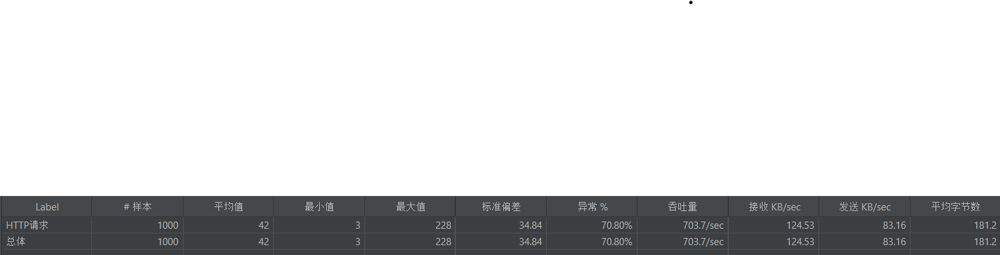

# Micro WebPoS 

请参考spring-petclinic-rest/spring-petclinic-microserivces 将webpos项目改为微服务架构，具体要求包括：
1. 至少包含独立的产品管理服务、订单管理服务以及discovery/gateway等微服务架构下需要的基础设施服务；
2. 请将系统内的不同微服务实现不同的计算复杂度，通过压力测试实验验证对单个微服务进行水平扩展（而无需整个系统所有服务都进行水平扩展）可以提升系统性能，请给出实验报告；
3. 请使用`RestTemplate`进行服务间访问，验证Client-side LB可行；
4. 请注意使用断路器等机制；
5. 如有兴趣可在kubernetes或者minikube上进行部署。

请编写readme对自己的系统和实验进行详细介绍。

## 系统介绍

程序分为四个模块：
- `api-gateway`：API网关，作为系统的入口点，处理所有外部请求。路由请求到适当的后端服务，同时使用 `Hystrix` 增加了熔断机制
- `discovery-server`：服务发现服务器，管理微服务实例的注册和发现。
- `order-server`：订单服务，负责处理与订单相关的业务逻辑，同时使用 `RestTemplate` 与 `product-server` 存在交互。
- `product-server`：产品服务，负责处理与产品相关的业务逻辑。

## 压力测试

本次测试测试 `order-server` 的 `get` 接口，该接口存在访问 `product-server` 的部分。

首先是只有一个服务，结果如下：

接着增加一个 `product-server` 服务，结果如下：

发现确实又有了提升，这说明单个微服务进行水平扩展（而无需整个系统所有服务都进行水平扩展）可以提升系统性能。

同时，由于存在微服务之间的访问，本次测试进行了多次，结果相差不大，这说明了使用 `RestTemplate` 进行服务间访问可以起到 `Client-side LB` 的作用。

接着再增加一个 `order-server` 服务，结果如下：

发现性能提升不大，猜测原因为性能瓶颈为 `product-server` 服务，而不是 `order-server` 服务，故增加 `order-server` 服务对性能影响不大。